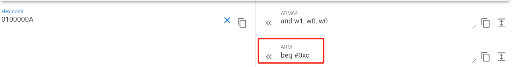

# ARM 汇编

# ARM v7 汇编
## 环境配置
首先将 clang 添加到临时环境变量中
```bash
 ➜ export PATH=$PATH:$ANDROID_HOME/ndk/21.0.6113669/toolchains/llvm/prebuilt/linux-x86_64/bin 
```

然后添加 makefile 文件
```makefile

```
汇编文件模板
```armasm
	.text
	.syntax unified
	.cpu	arm7tdmi
	.globl	main                    @ -- Begin function main
	.p2align	2
	.type	main,%function
	.code	32                      @ @main
main:
    push {lr}

    mov r0, #0
    pop {lr}
    bx lr
```

## 编写汇编代码

### 调用 printf 函数
```armasm
	.text
	.syntax unified
	.cpu	arm7tdmi
	.globl	main                    @ -- Begin function main
	.p2align	2
	.type	main,%function
	.code	32                      @ @main
main:
	push {lr}

	ldr r0, [r1]  @ 输出 argv[0]
    bl printf

    mov r0, #0
	pop {lr}
	bx lr
```

### 显示简单的 ls 功能
```armasm
	.text
	.syntax unified
	.cpu	arm7tdmi
	.globl	main                    @ -- Begin function main
	.p2align	2
	.type	main,%function
	.code	32                      @ @main
main:
	push {r4, r5, lr}

    ldr r0, [r1, #4]
    bl opendir
    cmp r0, #0
    beq .LABEL_EXIT
    mov r4, r0          @ r4保存返回值
    bl readdir
    cmp r0, #0
    beq .LABEL_CLOSE_DIR

    ldr r5, .formart_str_
.LABEL0:
    add r5, pc, r5

.LOOP_READDIR:

    add r1, r0, #0x13
    mov r0, r5
    bl printf
    mov r0, r4
    bl readdir
    cmp r0, #0
    bne .LOOP_READDIR


.LABEL_CLOSE_DIR:
    mov r0, r4
    bl closedir


.LABEL_EXIT:
    mov r0, #0
	pop {r4, r5, lr}
	bx lr

.formart_str_:
    .long .formart_str-(.LABEL0 + 8)

.formart_str:
    .asciz "%s\r\n"     @ 表示定义一个以0结尾的字符串， ascii 表示定义一个不以0结尾的字符串
```

## 如何查看文档
我这里使用的文档是[DDI0487A_a_armv8_arm.pdf](http://kib.kiev.ua/x86docs/ARMARM/DDI0487A_a_armv8_arm.pdf)

### 查看 AArch32 平台 beq 指令

首先通过目录 `The AArch32 Instruction Sets Overview  -> Branch instructions`找到跳转指令的页面，最终找到 b 指令文档页面。


其中 cond 表示条件，需要去 `About the T32 and A32 Instruction Descriptions ->Conditional execution` 查找。


通过文档我们可以知道，BEQ 指令为下列格式：
```
0000 1010 xxxx xxxx xxxx xxxx xxxx xxxx
```
其中 `xxxx xxxx xxxx xxxx xxxx xxxx` 表示  imm24 ，根据 imm32 算法，最终 imm24 应该是如下方式显示，其中 `s` 表示符号。
```
ssss ss xxxx xxxx xxxx xxxx xxxx xxxx00
```
举例说明
```
0000 1010 0000 0000 0000 0000 0000 0001   // 16进制为0100000A
```

 imm32 的值为：
```
0000 000000 0000 0000 0000 0000 000100
```
由于 RAM 指令的 3 级流水线，实际跳转指令为 `beq 0x4 + 2*指令长度` = `beq 0xC` 。

最终去 [armconverter](https://armconverter.com/) 网站进行验证：



## 查看 AArch64 平台 `ldr x2, [x3], 2` 指令


根据文档，该指令二进制如下所示。
```bash
11 111 0 00 01 0 000000010 01 00011 00010
```
对应的 16 进制为 0xF8402462 。


、