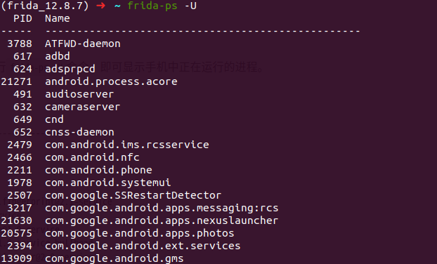
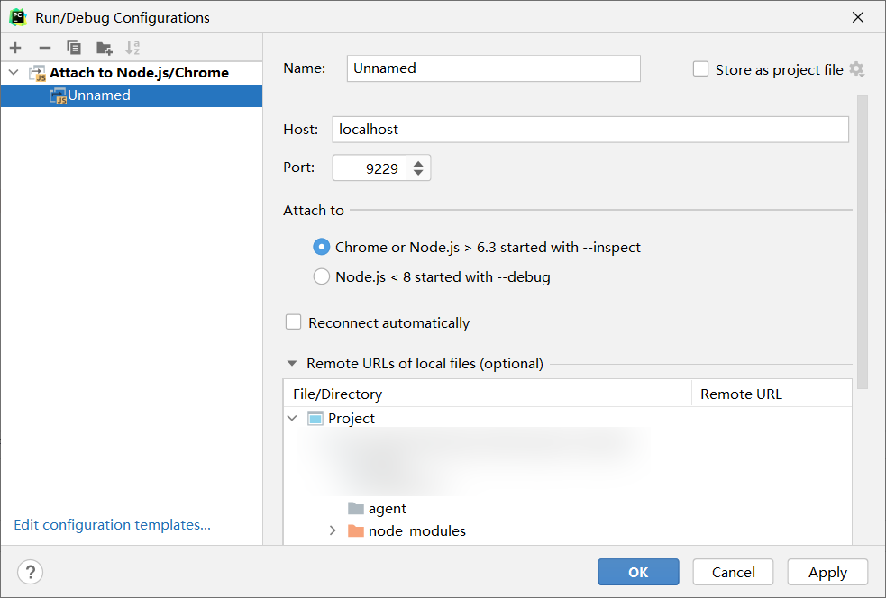

> 源码地址：https://github.com/frida/frida

> 官网：https://frida.re/


# 环境配置

## 安装 Frida
在安装 `Frida` 之前最好创建一个 `python` 虚拟环境，这样可以避免与其他环境产生干扰
```
$ mkvirtualenv -p python3 frida_12.8.7
```
> 这里使用 `pyenv` 创建虚拟环境更方便。目前我使用 `miniconda` 。

**安装最新版**

进入虚拟环境，直接运行下来命令即可安装完成
```
pip install frida-tools # CLI tools
pip install frida       # Python bindings
```
安装完成后，运行 `frida --version` 查看 frida 的版本


**安装特定版 Frida**

通过 [Frida Releases](https://github.com/frida/frida/releases) 页面找到需要安装的 `frida-tools` 版本，使用 `pip` 指定版本安装，这里以 `Frida 12.11.18` 为例。

首先找到 `frida-tools` 版本。


然后使用 `pip` 安装对应的版本，下面为完整安装命令。
```bash
pip install frida==12.11.18
pip install frida-tools==8.2.0
```

安装完成后，根据 `Frida` 的版本去[下载](https://github.com/frida/frida/releases)对应的 `frida-server`。

最后将 `frida-server push` 进 `data/local/tmp` 目录，并给予其运行权限，使用 `root` 用户启动。
```
$ adb push frida-server data/local/tmp/
$ adb shell
sailfish:/ $ su
sailfish:/ # chmod +x data/local/tmp/frida-server
sailfish:/ # data/local/tmp//frida-server &
```
执行 `frida-ps -U` ,出现以下信息则表明安装成功。




## 配置开发环境
为了在开发 Frida 脚本时有代码补全提示，我们可以使用下面两种方式进行环境配置。

### 引用 `frida-gum.d.ts`
在 `Frida` 源码中获取 [frida-gum.d.ts](https://github.com/frida/frida-gum/tree/6e36eebe1aad51c37329242cf07ac169fc4a62c4/bindings/gumjs/types/frida-gum) 文件，该文件包含了所有的 API 。

在我们开发的 `js` 脚本首行中引用 `frida-gum.d.ts` 文件，即可实现代码补全提示。
```
`///<reference path='./frida-gum.d.ts'/>`
```


其他方式获取 `frida-gum.d.ts` 文件：
> https://www.npmjs.com/package/@types/frida-gum

### 使用 `TypeScript` 
使用 `Frida` 作者提供的开发环境 [frida-agent-example](https://github.com/oleavr/frida-agent-example) ，该环境需要使用 `TypeScript` 开发。

构建开发环境
```bash
$ git clone git://github.com/oleavr/frida-agent-example.git
$ cd frida-agent-example/
$ npm install
```

启用实时编译
```bash
$ npm run watch
# 或者
$ frida-compile agent/index.ts -o _agent.js -w
```
后续直接使用 `index.ts` 开发即可实现代码补全提示。

## 配置调试环境
这里主要使用 `chrome` 和 `pycharm` 两种方式进行调试。

首先使用 `Frida` 命令或者 `python` 脚本以调试模式加载 `js` 脚本。

Frida 命令:
```bash
frida -U com.example.android -l _agent.js --debug --runtime=v8 <port/name>
```
python 脚本:
```python
session = dev.attach(app.pid)
script = session.create_script(jscode, runtime="v8")
session.enable_debugger()
```

启动后会回显 `Inspector` 正在监听 `9229` 默认端口 。

### chome
打开 `chrome://inspect` 页面, 点击 `Open dedicated DevTools for Node` 。


此时 `debug` 已经连接，切换至 `Sources` ，按 `Command + P` 加载要调试的脚本，即可下断调试了。


### pycharm
首先安装 `Node.js` 插件，重启。然后添加调试器 `Attaching to Node.js/Chrome`，端口默认即可。



> 我这里使用的 `node` 版本为 12.21.0 。

在 `ts` 文件中设置好断点，执行 pycharm 调试功能即可。


> 如果调试 `js` 脚本， 触发断点需要在 `debug` 窗口切换到 `script` 选项卡，右键要调试的脚本，选择 `Open Actual Source`，在新打开的 `Actual Source` 窗口设置好断点后，需要再取消/启用一次所有断点作为激活，发现断点上打上对勾才真正可用了。（未测试）

> 参考：https://bbs.pediy.com/thread-265160-1.htm

# Frida 使用

## Frida 启动

### attach 启动
`attach` 到已经存在的进程，核心原理是 `ptrace` 修改进程内存，如果进程处于调试状态（ `traceid` 不等于 `0` ），则 `attach` 失败。启动命令如下：
```bash
$ frida -U com.example.android --no-pause -l _agent.js
# 或者
$ frida -UF --no-pause -l _agent.js
```
- `-U` : 连接 USB 设备。
- `-l` : 加载脚本。
- `--no-pause` : 启动后自动启动主线程。
- `-F` : 附加最前面的应用。

以上命令对应的 `python` 脚本如下：
```python
import sys
import time
import frida

def on_message(message,data):
    print("message",message)
    print("data",data)

device = frida.get_usb_device()
session = device.attach("com.example.android")

with open("_agent.js","r", encoding = "utf8") as f:
    script = session.create_script(f.read())

script.on("message",on_message)
script.load()
sys.stdin.read()
```

### spawn 启动
启动一个新的进程并挂起，在启动的同时注入 `frida` 代码，适用于在进程启动前的一些 `hook` ，如 `hook RegisterNative` 等，注入完成后调用 `resume` 恢复进程。启动命令如下：
```bash
frida -U -f com.example.android --no-pause  -l _agent.js
```
对应的 `python` 脚本如下：
```python
import sys
import time
import frida

def on_message(message,data):
    print("message",message)
    print("data",data)

device = frida.get_usb_device()
pid = device.spawn(["com.example.android"])
device.resume(pid)
session = device.attach(pid)

with open("_agent.js",'r', encoding = "utf8") as f:
    script = session.create_script(f.read())

script.on("message",on_message)
script.load()

sys.stdin.read()
```

## 自定义端口

默认情况下启动 `frida-server` 将会开启 `27042` 端口，如下所示：
```bash
sailfish:/ # netstat -tunlp |grep frida
tcp        0      0 127.0.0.1:27042         0.0.0.0:*               LISTEN      5038/frida-server-14.2.18-android-arm64
tcp        0      0 127.0.0.1:27042         127.0.0.1:46075         ESTABLISHED 5038/frida-server-14.2.18-android-arm64
tcp6       0      0 :::49039                :::*                    LISTEN      5038/frida-server-14.2.18-android-arm64
```
如果该端口被占用，启动 `frida-server` 将会失败，我们可以使用 `-l` 参数自定义端口，如下所示：
```bash
sailfish:/ # /data/local/tmp/frida-server-14.2.18-android-arm64 -l 0.0.0.0:6666 &
```

对应的 `Frida` 启动方式也需要作相应的改变，如下所示：
```bash
$ adb forward tcp:6666 tcp:6666
6666
$ frida -H 127.0.0.1:6666 com.example.android -l _agent.js
```
对应的 `python` 脚本如下：
```python
# -*- coding: UTF-8 -*-

import frida, sys

jsCode = """
console.log("test");
"""

def message(message, data):
    if message['type'] == 'send':
        print(f"[*] {message['payload']}")
		else:
				print(message)

process = frida.get_device_manager().add_remote_device('127.0.0.1:6666').attach('com.example.android')
script = process.create_script(jsCode)
script.on("message",message)
script.load()
input()
```

> 如果使用无线 `adb` 连接，则需要改变对应的 `IP` 为 [WADB](https://github.com/RikkaApps/WADB) 显示的 `IP` 即可。


# Frida Hook Java


### write-ups-2015
首先我们根据 Frida 官网给的[测试用例](https://github.com/ctfs/write-ups-2015/tree/master/seccon-quals-ctf-2015/binary/reverse-engineering-android-apk-1)简单的熟悉一下 Frida 的使用。

创建一个 `ctf.py` 文件，内容如下：
```python
import frida, sys

def on_message(message, data):
    if message['type'] == 'send':
        print("[*] {0}".format(message['payload']))
    else:
        print(message)

jscode = """
Java.perform(function () {
    // 获取需要 hook 方法的类
    var MainActivity = Java.use('com.example.seccon2015.rock_paper_scissors.MainActivity');
    
    var MainActivity$1 = Java.use('com.example.seccon2015.rock_paper_scissors.MainActivity$1');

    var run = MainActivity$1.run;
    // 找到需要 hook 的方法
    var onClick = MainActivity.onClick;
    onClick.implementation = function (v) {
      // 与 Frida 进行通信
      send('onClick');
  
      // 调用原始函数
      onClick.call(this, v);
  
      // 原始函数调用完成后，修改相应的变量
      this.m.value = 0;
      this.n.value = 1;
      this.cnt.value = 999;

    };

    run.implementation = function () {
        // 与 Frida 进行通信
        send('run');
    
        run.call(this)
        
        // 输出 cnt 的值
        console.log('Done:' + JSON.stringify(this.this$0.value.cnt.value));
      };
  });
"""

process = frida.get_usb_device().attach('com.example.seccon2015.rock_paper_scissors')
script = process.create_script(jscode)
script.on('message', on_message)
print('[*] Running CTF')
script.load()
sys.stdin.read()
```
直接运行 `python ctf.py` ，将会输入下列内容。
```bash
λ python ctf.py
[*] Running CTF
[*] onClick
[*] run
Done:1000
```


# Frida 代码片段

Hook StringBuilder and print data only from a specific class
```javascript
var sbActivate = false;

Java.perform(function() {
  const StringBuilder = Java.use('java.lang.StringBuilder');
  StringBuilder.toString.implementation = function() {

    var res = this.toString();
    if (sbActivate) {
        var tmp = "";
        if (res !== null) {
          tmp = res.toString().replace("/n", "");
          console.log(tmp);
        }
    }
    return res;
  };

});

Java.perform(function() {
  const someclass = Java.use('<the specific class you are interested in>');
  someclass.someMethod.implementation = function() {

    sbActivate = true;
    var res = this.someMethod();
    sbActivate = false;

    return res;
  };

});
```

byte[]这种 hook输出的时候该怎么写呢？
```javascript
var ByteString = Java.use("com.android.okhttp.okio.ByteString");
var j = Java.use("c.business.comm.j");
j.x.implementation = function() {
    var result = this.x();
    console.log("j.x:", ByteString.of(result).hex());
    return result;
};

j.a.overload('[B').implementation = function(bArr) {
    this.a(bArr);
    console.log("j.a:", ByteString.of(bArr).hex());
};
```

hook Androd 7以上的 dlopen 。
```javascript
var android_dlopen_ext = Module.findExportByName(null, "android_dlopen_ext");
console.log(android_dlopen_ext);
if (android_dlopen_ext != null) {
    Interceptor.attach(android_dlopen_ext, {
        onEnter: function (args) {
            var soName = args[0].readCString();
            console.log(soName);
            if (soName.indexOf("**.so") !== -1) {
                console.log("------load **----------")
                this.hook = true;
            }
        },
        onLeave: function (retval) {
            if (this.hook) {
                //TODO hookso
            }
        }
    });
}
```

frida如何注入dex？
```javascript
Java.openClassFile(dexPath).load();
```

在系统里装上这个这个npm包，可以在任意工程获得frida的代码提示、补全和API查看。
```
npm i -g @types/frida-gum
```