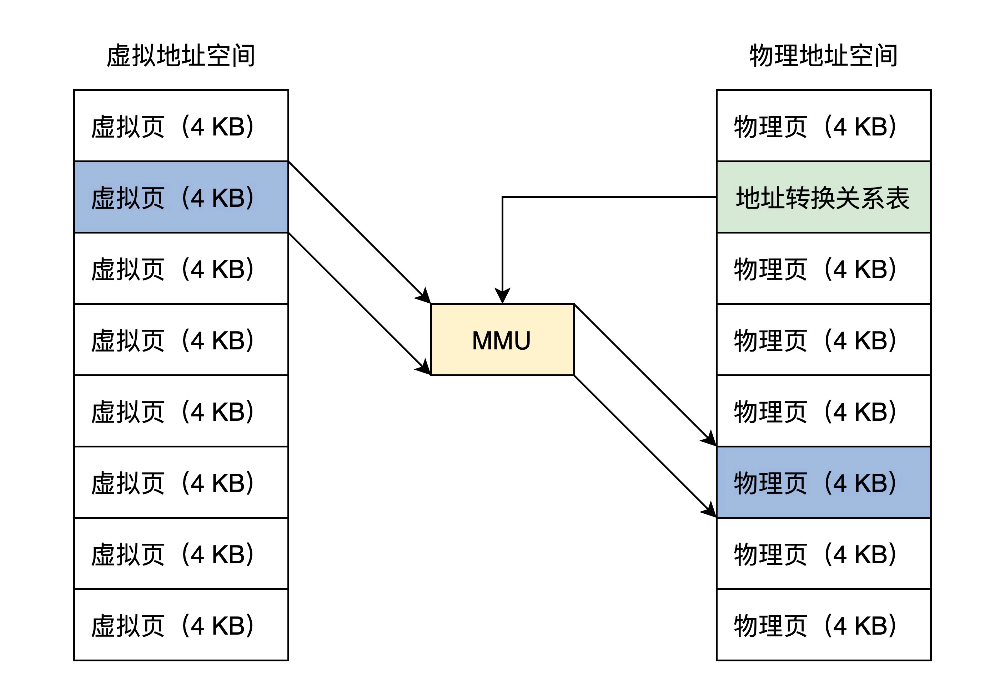
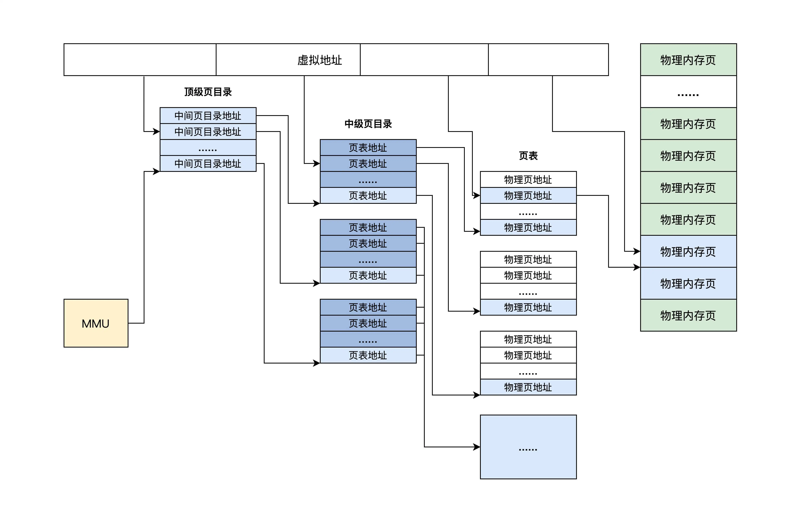
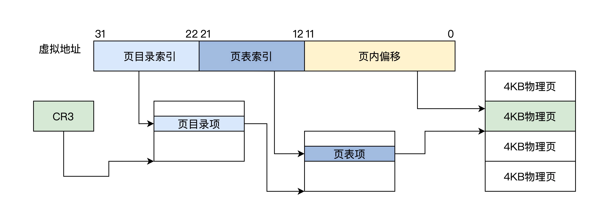
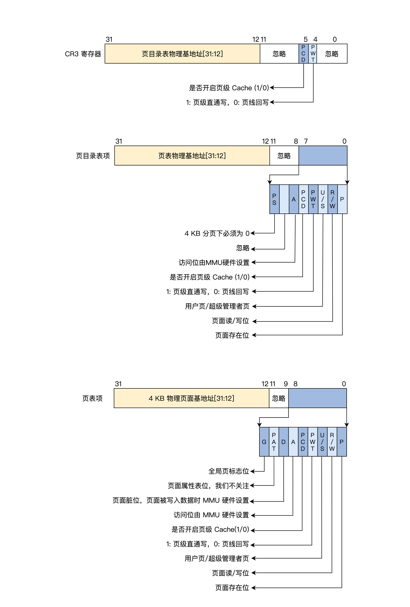
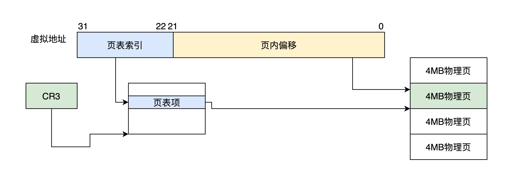
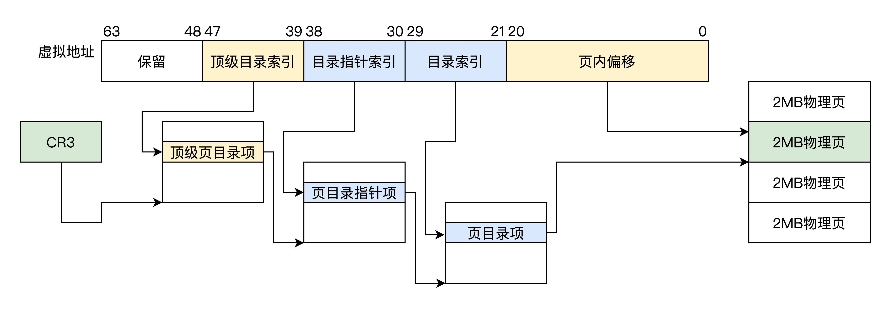

## 虚拟地址和物理地址

### 虚拟地址
正如其名，这个地址是虚拟的，自然而然地和具体环境进行了解耦，这个环境包括系统软件环境和硬件环境。

虚拟地址是逻辑上存在的一个数据值，比如 0~100 就有 101 个整数值，这个 0~100 的区间就可以说是一个虚拟地址空间，该虚拟地址空间有 101 个地址。

### 物理地址

虽然虚拟地址解决了很多问题，但是虚拟地址只是逻辑上存在的地址，无法作用于硬件电路的，程序装进内存中想要执行，就需要和内存打交道，从内存中取得指令和数据。而内存只认一种地址，那就是物理地址。

什么是物理地址呢？物理地址在逻辑上也是一个数据，只不过这个数据会被地址译码器等电子器件变成电子信号，放在地址总线上，地址总线电子信号的各种组合就可以选择到内存的储存单元了。

但是地址总线上的信号（即物理地址），也可以选择到别的设备中的储存单元，如显卡中的显存、I/O 设备中的寄存器、网卡上的网络帧缓存器。不过如果不做特别说明，我们说的物理地址就是指选择内存单元的地址。

## 虚拟地址到物理地址的转换

明白了虚拟地址和物理地址之后，我们发现虚拟地址必须转换成物理地址，这样程序才能正常执行。要转换就必须要转换机构，它相当于一个函数：p=f(v)，输入虚拟地址 v，输出物理地址 p。

那么要怎么实现这个函数呢？

用软件方式实现太低效，用硬件实现没有灵活性，最终就用了软硬件结合的方式实现，它就是 MMU（内存管理单元）。MMU 可以接受软件给出的地址对应关系数据，进行地址转换。

我们先来看看逻辑上的 MMU 工作原理框架图。如下图所示：


上图中展示了 MMU 通过地址关系转换表，将 0x80000~0x84000 的虚拟地址空间转换成 0x10000~0x14000 的物理地址空间，而地址关系转换表本身则是放物理内存中的。

下面我们不妨想一想地址关系转换表的实现. 如果在地址关系转换表中，这样来存放：一个虚拟地址对应一个物理地址。

那么问题来了，32 位地址空间下，4GB 虚拟地址的地址关系转换表就会把整个 32 位物理地址空间用完，这显然不行。

要是结合前面的保护模式下分段方式呢，地址关系转换表中存放：一个虚拟段基址对应一个物理段基址，这样看似可以，但是因为段长度各不相同，所以依然不可取。

综合刚才的分析，系统设计者最后采用一个折中的方案，即把虚拟地址空间和物理地址空间都分成同等大小的块，也称为页，按照虚拟页和物理页进行转换。根据软件配置不同，这个页的大小可以设置为 4KB、2MB、4MB、1GB，这样就进入了现代内存管理模式——分页模型。

下面来看看分页模型框架，如下图所示：



结合图片可以看出，一个虚拟页可以对应到一个物理页，由于页大小一经配置就是固定的，所以在地址关系转换表中，只要存放虚拟页地址对应的物理页地址就行了。

我知道，说到这里，也许你仍然没搞清楚 MMU 和地址关系转换表的细节，别急，我们现在已经具备了研究它们的基础，下面我们就去探索它们。

## MMU

MMU 即内存管理单元，是用硬件电路逻辑实现的一个地址转换器件，它负责接受虚拟地址和地址关系转换表，以及输出物理地址。

根据实现方式的不同，MMU 可以是独立的芯片，也可以是集成在其它芯片内部的，比如集成在 CPU 内部，x86、ARM 系列的 CPU 就是将 MMU 集成在 CPU 核心中的。

SUN 公司的 CPU 是将独立的 MMU 芯片卡在总线上的，有一夫当关的架势。下面我们只研究 x86 CPU 中的 MMU。x86 CPU 要想开启 MMU，就必须先开启保护模式或者长模式，实模式下是不能开启 MMU 的。

由于保护模式的内存模型是分段模型，它并不适合于 MMU 的分页模型，所以我们要使用保护模式的平坦模式，这样就绕过了分段模型。这个平坦模型和长模式下忽略段基址和段长度是异曲同工的。地址产生的过程如下所示。


上图中，程序代码中的虚拟地址，经过 CPU 的分段机制产生了线性地址，平坦模式和长模式下线性地址和虚拟地址是相等的。

如果不开启 MMU，在保护模式下可以关闭 MMU，这个线性地址就是物理地址。因为长模式下的分段弱化了地址空间的隔离，所以开启 MMU 是必须要做的，开启 MMU 才能访问内存地址空间。

### MMU 页表

现在我们开始研究地址关系转换表，其实它有个更加专业的名字——页表。它描述了虚拟地址到物理地址的转换关系，也可以说是虚拟页到物理页的映射关系，所以称为页表。

为了增加灵活性和节约物理内存空间（因为页表是放在物理内存中的），所以页表中并不存放虚拟地址和物理地址的对应关系，只存放物理页面的地址，MMU 以虚拟地址为索引去查表返回物理页面地址，而且页表是分级的，总体分为三个部分：一个顶级页目录，多个中级页目录，最后才是页表，逻辑结构图如下.




从上面可以看出，一个虚拟地址被分成从左至右四个位段。

第一个位段索引顶级页目录中一个项，该项指向一个中级页目录，然后用第二个位段去索引中级页目录中的一个项，该项指向一个页目录，再用第三个位段去索引页目录中的项，该项指向一个物理页地址，最后用第四个位段作该物理页内的偏移去访问物理内存。这就是 MMU 的工作流程。

## 保护模式下的分页

前面的内容都是理论上帮助我们了解分页模式原理的，分页模式的灵活性、通用性、安全性，是现代操作系统内存管理的基石，更是事实上的标准内存管理模型，现代商用操作系统都必须以此为基础实现虚拟内存功能模块。

因为我们的主要任务是开发操作系统，而开发操作系统就落实到真实的硬件平台上去的，下面我们就来研究 x86 CPU 上的分页模式。

首先来看看保护模式下的分页，保护模式下只有 32 位地址空间，最多 4GB-1 大小的空间。

根据前面得知 32 位虚拟地址经过分段机制之后得到线性地址，又因为通常使用平坦模式，所以线性地址和虚拟地址是相同的。

保护模式下的分页大小通常有两种，一种是 4KB 大小的页，一种是 4MB 大小的页。分页大小的不同，会导致虚拟地址位段的分隔和页目录的层级不同，但虚拟页和物理页的大小始终是等同的。

### 保护模式下的分页——4KB 页

该分页方式下，32 位虚拟地址被分为三个位段：页目录索引、页表索引、页内偏移，只有一级页目录，其中包含 1024 个条目 ，每个条目指向一个页表，每个页表中有 1024 个条目。其中一个条目就指向一个物理页，每个物理页 4KB。这正好是 4GB 地址空间。如下图所示。




上图中 CR3 就是 CPU 的一个 32 位的寄存器，MMU 就是根据这个寄存器找到页目录的。下面，我们看看当前分页模式下的 CR3、页目录项、页表项的格式。



可以看到，页目录项、页表项都是 4 字节 32 位，1024 个项正好是 4KB（一个页），因此它们的地址始终是 4KB 对齐的，所以低 12 位才可以另作它用，形成了页面的相关属性，如是否存在、是否可读可写、是用户页还是内核页、是否已写入、是否已访问等。

### 保护模式下的分页——4MB 页

该分页方式下，32 位虚拟地址被分为两个位段：页表索引、页内偏移，只有一级页目录，其中包含 1024 个条目。其中一个条目指向一个物理页，每个物理页 4MB，正好为 4GB 地址空间，如下图所示。



CR3 还是 32 位的寄存器，只不过不再指向顶级页目录了，而是指向一个 4KB 大小的页表，这个页表依然要 4KB 地址对齐，其中包含 1024 个页表项，格式如下图。


可以发现，4MB 大小的页面下，页表项还是 4 字节 32 位，但只需要用高 10 位来保存物理页面的基地址就可以。因为每个物理页面都是 4MB，所以低 22 位始终为 0，为了兼容 4MB 页表项低 8 位和 4KB 页表项一样，只不过第 7 位变成了 PS 位，且必须为 1，而 PAT 位移到了 12 位。

## 长模式下的分页

如果开启了长模式，则必须同时开启分页模式，因为长模式弱化了分段模型，而分段模型也确实有很多不足，不适应现在操作系统和应用软件的发展。

同时，长模式也扩展了 CPU 的位宽，使得 CPU 能使用 64 位的超大内存地址空间。所以，长模式下的虚拟地址必须等于线性地址且为 64 位。

长模式下的分页大小通常也有两种，4KB 大小的页和 2MB 大小的页。

### 长模式下的分页——4KB 页

该分页方式下，64 位虚拟地址被分为 6 个位段，分别是：保留位段，顶级页目录索引、页目录指针索引、页目录索引、页表索引、页内偏移，顶级页目录、页目录指针、页目录、页表各占有 4KB 大小，其中各有 512 个条目，每个条目 8 字节 64 位大小，如下图所示。


上面图中 CR3 已经变成 64 位的 CPU 的寄存器，它指向一个顶级页目录，里面的顶级页目项指向页目录指针，依次类推。

需要注意的是，虚拟地址 48 到 63 这 16 位是根据第 47 位来决定的，47 位为 1，它们就为 1，反之为 0，这是因为 x86 CPU 并没有实现全 64 位的地址总线，而是只实现了 48 位，但是 CPU 的寄存器却是 64 位的。

这种最高有效位填充的方式，即使后面扩展 CPU 的地址总线也不会有任何影响，下面我们去看看当前分页模式下的 CR3、顶级页目录项、页目录指针项、页目录项、页表项的格式，我画了一张图帮你理解。


由上图可知，长模式下的 4KB 分页下，由一个顶层目录、二级中间层目录和一层页表组成了 64 位地址翻译过程。

顶级页目录项指向页目录指针页，页目录指针项指向页目录页，页目录项指向页表页，页表项指向一个 4KB 大小的物理页，各级页目录项中和页表项中依然存在各种属性位，这在图中已经说明。其中的 XD 位，可以控制代码页面是否能够运行。

### 长模式下的分页——2MB 页

在这种分页方式下，64 位虚拟地址被分为 5 个位段 ：保留位段、顶级页目录索引、页目录指针索引、页目录索引，页内偏移，顶级页目录、页目录指针、页目录各占有 4KB 大小，其中各有 512 个条目，每个条目 8 字节 64 位大小。



可以发现，长模式下 2MB 和 4KB 分页的区别是，2MB 分页下是页目录项直接指向了 2MB 大小的物理页面，放弃了页表项，然后把虚拟地址的低 21 位作为页内偏移，21 位正好索引 2MB 大小的地址空间。

下面我们还是要去看看 2MB 分页模式下的 CR3、顶级页目录项、页目录指针项、页目录项的格式，格式如下图。


上图中没有了页表项，取而代之的是，页目录项中直接存放了 2MB 物理页基地址。由于物理页始终 2MB 对齐，所以其地址的低 21 位为 0，用于存放页面属性位。

## 开启 MMU

要使用分页模式就必先开启 MMU，但是开启 MMU 的前提是 CPU 进入保护模式或者长模式，开启 CPU 这两种模式的方法，我们在前面第五节课已经讲过了，下面我们就来开启 MMU，步骤如下：

1. 使 CPU 进入保护模式或者长模式。

2. 准备好页表数据，这包含顶级页目录，中间层页目录，页表，假定我们已经编写了代码，在物理内存中生成了这些数据。

3. 把顶级页目录的物理内存地址赋值给 CR3 寄存器。
```armasm
mov eax, PAGE_TLB_BADR ;页表物理地址
mov cr3, eax
```

4. 设置 CPU 的 CR0 的 PE 位为 1，这样就开启了 MMU。
```asm
;开启 保护模式和分页模式
mov eax, cr0
bts eax, 0 ;CR0.PE =1
bts eax, 31 ;CR0.P = 1
mov cr0, eax
```
## MMU 地址转换失败

MMU 的主要功能是根据页表数据把虚拟地址转换成物理地址，但有没有可能转换失败？

绝对有可能，例如，页表项中的数据为空，用户程序访问了超级管理者的页面，向只读页面中写入数据。这些都会导致 MMU 地址转换失败。

MMU 地址转换失败了怎么办呢？失败了既不能放行，也不是 reset，MMU 执行的操作如下。

1.MMU 停止转换地址。

2.MMU 把转换失败的虚拟地址写入 CPU 的 CR2 寄存器。

3.MMU 触发 CPU 的 14 号中断，使 CPU 停止执行当前指令。

4.CPU 开始执行 14 号中断的处理代码，代码会检查原因，处理好页表数据返回。

5.CPU 中断返回继续执行 MMU 地址转换失败时的指令。

这里你只要先明白这个流程就好了，后面课程讲到内存管理的时候我们继续探讨。

