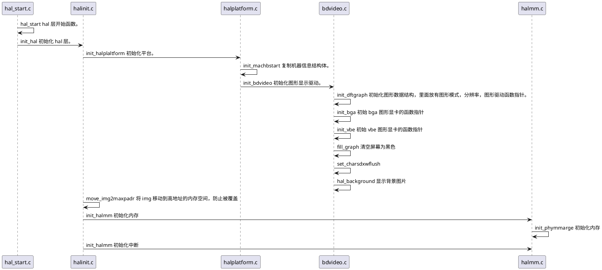

```puml
@startuml
hal_start.c -> hal_start.c : hal_start hal 层开始函数。 
hal_start.c -> halinit.c : init_hal 初始化 hal 层。
halinit.c -> halplatform.c : init_halplaltform 初始化平台。
halplatform.c -> halplatform.c : init_machbstart 复制机器信息结构体。
halplatform.c -> bdvideo.c : init_bdvideo 初始化图形显示驱动。
bdvideo.c -> bdvideo.c : init_dftgraph 初始化图形数据结构，里面放有图形模式，分辨率，图形驱动函数指针。
bdvideo.c -> bdvideo.c : init_bga 初始 bga 图形显卡的函数指针
bdvideo.c -> bdvideo.c : init_vbe 初始 vbe 图形显卡的函数指针
bdvideo.c -> bdvideo.c : fill_graph 清空屏幕为黑色
bdvideo.c -> bdvideo.c : set_charsdxwflush 
bdvideo.c -> bdvideo.c : hal_background 显示背景图片 
halinit.c -> halinit.c : move_img2maxpadr 将 img 移动到高地址的内存空间，防止被覆盖
halinit.c -> halmm.c : init_halmm 初始化内存
halmm.c -> halmm.c : init_phymmarge 初始化内存
halinit.c -> halmm.c : init_halmm 初始化中断
@enduml
```