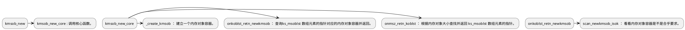

分配内存

```puml
@startuml
kmsob_new -> kmsob_new_core : 调用核心函数。
kmsob_new_core -> onmsz_retn_koblst ： 根据内存对象大小查找并返回 ks_msoblst 数组元素的指针。
kmsob_new_core -> onkoblst_retn_newkmsob ： 查询ks_msoblst 数组元素的指针对应的内存对象容器并返回。
onkoblst_retn_newkmsob -> scan_newkmsob_isok ： 看看内存对象容器是不是合乎要求。
kmsob_new_core -> _create_kmsob ： 建立一个内存对象容器。
@enduml
```